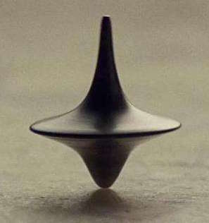

# 基于Bézier曲线的三维造型与渲染

_2015011330 计54 陈驰_

<h3>目录</h3>

[TOC]

## 概要

本次实验我完成了如下内容:

- Bézier曲线旋转造型

- 图片渲染

    - 渐进式光子映射

    - 三次曲线牛顿法迭代求交

    - 物体贴图

    - 超采样抗锯齿

    - 渲染加速

以下对这些内容分部分进行详细描述。

## Bézier曲线旋转造型

选用了两段三次Bézier曲线和一段二次Bézier曲线进行拼接，并旋转一圈得到了旋转体（以下简称Bézier物体）。造型灵感来自于盗梦空间中的经典物像陀螺，最终效果如下：

 

## 图片渲染

### 渐进式光子映射

#### 算法概述
渐进式光子映射首先对视线做追踪，得到一系列的采样点，将这些采样点组成kd-tree结构，然后不断的发射光子，每当射到物体表面的光子对某一个采样点做出贡献时，便缩小该采样点的半径。

理论上，光子数量趋于无穷大时，采样点的密度估计范围趋于零，因而时间足够长时，该算法能达到足够高的精度。同时，由于只需要存储采样点，PPM算法也有能力利用任意大数量的光子。

在我的实际实现中，算法的流程主要包括三个部分：

- __获取采样点__

    从摄像机发出相应的视线，判断与场景最近的交点，根据相交物体材质的不同做反射、折射处理，并在遇到漫反射面时记录相交点的信息。
```c++
    /* 交点类 */
    struct HitPoint
    {
        Vec3 pos, norm, dir, flux;  // 位置，法向，射线方向，光通量
        int pixel_id;               // 对应像素点
        Vec3 weight;                // 对像素点的贡献权重
        double R2;                  // 半径平方
        unsigned int n;             // 光子数量
    };
```
    
&nbsp;&nbsp;&nbsp;&nbsp;&nbsp;&nbsp;&nbsp;&nbsp;之后，将所有得到的采样点按照它们的空间位置建立一棵kd-tree，以便之后进行快速查找。

- __发射光子__

    由每个光源不断发射光子，做与第一步中类似的操作，直到漫反射面时，通过其位置在kd-tree中进行查询，找到所有能够贡献的采样点，并更新它们的信息。注意到光子的信息并不需要存储，只要在追踪时递归的传递下去即可。采样点更新的公式如下：

    $$R_{i+1}^{2} = R_{i}^{2}\frac{N_{i} + \alpha{M_{i}}}{N_{i} + M_{i}}$$
    $$\tau_{i+1} = \tau_{i}\frac{N_{i} + \alpha{M_{i}}}{N_{i} + M_{i}}$$

```c++
    /* 发射光子 */
    for (int i = 0; i < epochs; i++)                                    // 发射epochs轮光子
    {
        int m = 1000 * epochs;                                          // 总光子数
        Ray r, Vec3 flux;                                               // 光子方向，颜色
        for (int j = 0; j < 1000; j++)
        {
            for (int k = 0; k < light.size(); k++) 
            {
                light[k]->genPhoton(r, flux, m + j);                    // 每个光源产生光子
                Raytracing(r, false, 0, flux, Vec3(1, 1, 1), m + j);    // 对光子进行追踪
            }
        }
    }   
```

```c++
    /* 
        更新采样点信息 
        r: 待更新的HitPoint
        photon: 光子位置
        n: 光子碰撞处法向
        color: 光子颜色
    */
    if (length2(r->pos - photon) <= r->R2 && dot(r->norm, n) > 1e-3)
    {
        double g = (r->n * alpha + alpha) / (r->n * alpha + 1.0);
        r->R2 = r->R2 * g;
        r->n++;
        r->flux = (r->flux + r->weight * color * (1. / PI)) * g;
    }
```

- __生成图片__

    遍历所有的采样点，更新对应的像素点的颜色，最终输出到文件。

```c++
    /* 计算每个像素点颜色 */
    for (it = hps.begin(); it != hps.end(); it++)                       // hps为采样点集合
    {
        HitPoint* hp = *it;
        int i = hp->pixel_id;
        c[i] = c[i] + hp->flux * (1.0 / (PI * hp->R2 * ix * 1000.0));   // 更新对应的像素点颜色
    }
```

下面详细说明实现的一些具体细节：

#### 面向对象的设计

- 设计了如下几个class及主要方法，通过继承和封装抽象出了算法逻辑，极大的提高了代码可读性

    |类名|主要成员|主要方法|说明|
    |--:|:--:|:--:|:--:|
    |interInfo|交点位置, 法向, etc| \|交点信息|
    |Material|三种表面系数，折射率| \| 材质 |
    |Object| interInfo, Material | intersect |物体类-求交|
    |Light|光源位置，颜色|getPhoton|光源-产生光子|
    |Camera|视点, 视方向, 视平面, etc| getEyeray|摄像机-产生视线|    

#### 光线追踪

```c++
    Raytracing(const Ray &ray, bool mode, int depth, Vec3 flux, Vec3 weight, int index);
```

- 该函数递归的进行光线追踪，下面解释参数：
  
    |参数名|说明|
    |:-:|:-:|
    |ray      |追踪的光线|
    |mode     |0-光子 1-视线|
    |depth    |递归深度|
    |flux     |光子能量|
    |weight   |采样点权重|
    |index    |光线序号|
    
- 具体的追踪过程为经典的光线追踪过程：
    
    先遍历物体，求出光线与场景最近的交点，判断相交物体的材质。

    - __漫反射面__：
        + 采样点：建立采样点，设定采样点权重为函数参数weight，相交信息由交点类提供；
        + 光子： 在kd-tree中搜索，更新能够更新的采样点；同时，按照一定的概率发出漫反射光线
    
    - __镜面反射面__：
        直接发出一条反射光线
    
    - __折射面__：
        + 采样点：按比例分配权重，分别发射出一条反射光线和一条折射光线（如果不是全反射）
        + 光子：按比例分配概率，以轮盘赌的方式发射出一条反射光线或一条折射光线（如果不是全反射）

### 牛顿法迭代求交

#### 概述

光线追踪最重要的步骤就是对光线和所有的物体依次求交，这个操作在物体是规则几何体时非常容易，但当遇到的是Bézier物体时，求交就会有一定的难度。

我采用的方法是对要求交的曲面和直线建立对应的方程，通过牛顿迭代法求交，需要求交的方程如下：

$$F(x) = F(t,u,v) \triangleq{L(t) - P(u,v)} = 0$$

其中L(t)和P(u,v)分别是直线和曲面的参数方程。

牛顿迭代法公式为

$$x_{i+1} = x_{i} - [F^{'}(x)]^{-1} \dot{} F(x)$$

使用Eigen库进行矩阵的求逆功能，满足一定的效率需求。

由于牛顿迭代法的收敛性需要F(x)在初始点局部满足Lipschitz条件，因而初始点的选取直接决定了算法的可靠性和效率。起初，我选择在定义域范围内随机撒点，结果发现效果很差，很多本来相交的地方都没能收敛到。之后我尝试了对曲面建立包围盒，并用直线与包围盒最近的交点作为迭代初始解，发现效果依然不尽如人意。和同学讨论后，最终选择了如下方法求交：

1. 初始时，设定 $u_{1} = 0$，$u_{2} = 1$; 

2. 对u1和u2为参数的曲线点建立两个圆柱包围体;

3. 检查曲线是否能够通过两个圆柱包围体中间，若不能通过，则返回无交点;

4. 若能通过，最多有6种这样的合法交点，若 $ |u_{1} - u_{2}| < \epsilon$，则将所有合法的交点当作初始点进行牛顿迭代，返回最近的一个交点；否则转5；

5. 对区间 $[u_{1},u_{2}]$ 二分，转2；

#### 具体代码

```c++
Vector3f BezierObj::merge(double u1, double u2, const Ray& r)
{
    // 圆柱包围盒
    Vec3 p1 = getPoint(u1), p2 = getPoint(u2);
    double r1 = p1.x, r2 = p2.x;
    vector<double> cand;
    if (fabs(r.d.y) > 1e-8) // 圆面相交
    {
        double t1 = (p1.y - r.o.y) / r.d.y;
        Vec3 tempP; double PR2;
        if (t1 > 1e-8)
        {
            tempP = r.o + t1 * r.d;
            PR2 = sqrt(tempP.x * tempP.x + tempP.z * tempP.z);
            if ((PR2 - r1) * (PR2 - r2) < 0) cand.push_back(t1); // 合法解为与圆环相交
        }
        double t2 = (p2.y - r.o.y) / r.d.y;
        if (t2 > 1e-8)
        {
            tempP = r.o + t2 * r.d;
            PR2 = sqrt(tempP.x * tempP.x + tempP.z * tempP.z);
            if ((PR2 - r1) * (PR2 - r2) < 0) cand.push_back(t2);
        }
    }
    double a = r.o.x, b = r.d.x, c = r.o.z, d = r.d.z;
    if ((d * d + b * b) > 1e-8) // 侧面相交
    {
        double temp = -a * a * d * d + 2.*a * b * c * d + b * b * (-c * c) + b * b * r1 * r1 + d * d * r1 * r1;
        if (temp > 0)
        {
            double t3 = (-sqrt(temp) - a * b - c * d) / (b * b + d * d);
            if (t3 > 1e-8 && (p1.y - r.o.y - t3 * r.d.y) * (p2.y - r.o.y - t3 * r.d.y) < 0) cand.push_back(t3); // 合法性判断
            double t4 = (sqrt(temp) - a * b - c * d) / (b * b + d * d);
            if (t4 > 1e-8 && (p1.y - r.o.y - t4 * r.d.y) * (p2.y - r.o.y - t4 * r.d.y) < 0) cand.push_back(t4);
        }
        temp = -a * a * d * d + 2.*a * b * c * d + b * b * (-c * c) + b * b * r2 * r2 + d * d * r2 * r2;
        if (temp > 0)
        {
            double t5 = (-sqrt(temp) - a * b - c * d) / (b * b + d * d);
            if (t5 > 1e-8 && (p1.y - r.o.y - t5 * r.d.y) * (p2.y - r.o.y - t5 * r.d.y) < 0) cand.push_back(t5);
            double t6 = (sqrt(temp) - a * b - c * d) / (b * b + d * d);
            if (t6 > 1e-8 && (p1.y - r.o.y - t6 * r.d.y) * (p2.y - r.o.y - t6 * r.d.y) < 0) cand.push_back(t6);
        }
    }
    int size = cand.size();
    if (size == 0) return Vector3f(INF, INF, INF); // 无交点则返回
    if (fabs(u1 - u2) < 1e-2)
    {
        Vector3f arg(INF, INF, INF);
        for (int i = 0; i < size; i++)
        {
            Vector3f temp_arg(cand[i], u1, atan2(r.o.z + cand[i] * r.d.z, r.o.x + cand[i] * r.d.x));
            Vector3f res = NewtonIt(temp_arg, r, 20, 1e-8); // 调用牛顿迭代法
            if (res[0] > 0 && res[0] < arg[0]) arg = res;
        }
        return arg;
    }
    Vector3f res1 = merge(u1, (u1 + u2) / 2, r), res2 = merge((u1 + u2) / 2, u2, r); // 二分求解
    return res1[0] < res2[0] ? res1 : res2;  // 返回较小解
}
```

### 物体贴图

我尝试对Bézier物体和地面进行了贴图操作，基本想法是将物体的材质参数由设定的常数变成在映射位置的贴图颜色，具体实现如下：
```c++
class Object
{
public:
    ...
    virtual Vec3 diff(const interInfo &info) {return m.diff;} // 提供接口，若无贴图返回预设颜色
}

// BezierObj类中贴图功能相关定义，Plane类类似
class BezierObj: public Object 
{
public:
    BezierObj(..., const char* texture): ... { loadTeture(texture); }
    Vec3 diff(const interInfo &info);   // 获得指定点的贴图颜色
    ...
private:
    ...
    void loadTexture(const char* t);    // 加载贴图
    bool hasTexture;                    // 有无贴图的标志
    cv::Mat texture;                    // 贴图图片
}

// 读取贴图，设定有贴图标志
void BezierObj::loadTexture(const char* t)
{
    has_texture = false;
    if (t == "") return;
    printf("Loading pic\n");
    texture = cv::imread(t);
    has_texture = true;
}

// 获得指定点的贴图颜色
Vec3 BezierObj::diff(const interInfo &info)
{
    int h = texture.rows, w = texture.cols;
    if (h == 0 || w == 0) return m.diff;                                            // 无贴图，返回设定颜色
    int du = int(h * info.u), dv = ((int)((info.v + PI) / (2 * PI) * w) + 30) % w;  // UV映射
    cv::Vec3b v3b = texture.at<cv::Vec3b>(du, dv);
    return Vec3((double)v3b[2] / 255, (double)v3b[1] / 255, (double)v3b[0] / 255);  // 返回归一化的RGB系数
}

```

### 渲染加速

我主要采用了kd-tree，包围盒加速两种渲染加速，同时使用了OpenMP做性能加速

#### kd-tree

对所有的采样点构建一棵kd-tree

#### 包围盒

包围盒分两种，一种是在求交时对Bézier物体做的圆柱包围盒（见上面），另一种是光子落到漫反射面，对采样点进行更新时，与对采样点整体构建的包围盒进行了判断。

```c++
void KdPoints::update(const Vec3 &photon, const Color &color, const Vec3 &n)
{
    if (photon.x < min.x && photon.y < min.y && photon.z < min.z) return; 
    if (photon.x > max.x && photon.y > max.y && photon.z > max.z) return; // 判断与包围盒相交
    update(root, photon, color, n);                                       // 扔进kd-tree进行操作
}
```


#### OpenMP

由于Max OSX 默认的编译器clang不支持OpenMP（虽然其他平台的clang已经可以通过LLVM使用它），因此我换用了gcc进行编译。

```bash
    gcc-7 -o ppm ppm.cpp -fopenmp -O3 -lstdc++
```

在代码中，考虑到每次发射的光子相互独立地对采样点进行更新，因此对这一部分使用OpenMP进行加速，实际渲染速度比仅使用O3优化快了一倍多。

```c++
    /* 发射光子 */
    #pragma omp parallel for schedule(dynamic, 1)                       // OpenMP对for循环并行化计算
    for (int i = 0; i < epochs; i++)                                    // 发射epochs轮光子
    {
        int m = 1000 * epochs;                                          // 总光子数
        Ray r, Vec3 flux;                                               // 光子方向，颜色
        for (int j = 0; j < 1000; j++)
        {
            for (int k = 0; k < light.size(); k++) 
            {
                light[k]->genPhoton(r, flux, m + j);                    // 每个光源产生光子
                Raytracing(r, false, 0, flux, Vec3(1, 1, 1), m + j);    // 对光子进行追踪
            }
        }
    }   
```

### 超采样抗锯齿

超级采样抗锯齿就是把当前分辨率成倍提高（如当前分辨率为1024×768,开启2倍的SSAA后，画面放大到2048×1536）,然后再把画缩放到当前的显示器上。这样的做法实际上就是在显示尺寸不变的情况提高分辨率，让单个像素变得极小，这样就能够大幅减轻画面的锯齿感了。(百度百科)

我的做法是先生成一张 4096 x 3072 的图片，再使用下采样将其缩小成 1024 x 768 的图片，对比效果如下：


<div align="center">
<span style="margin-right: 45%;">有SSAA</span>  <span align="center">无SSAA</span>
</div>
<br>
仔细观察图像边缘，效果提升比较明显。

## 最终结果


另外我尝试了一下初始半径对图片的影响


<div align="center">
<span style="margin-right: 45%;">$R_{0}^{2} = 1$</span>  <span align="center">$R_{0}^{2} = 3$</span>
</div>
<br>


<div align="center">
<span style="margin-right: 45%;">$R_{0}^{2} = 5$</span>  <span align="center">$R_{0}^{2} = 10$</span>
</div>
<br>
上面的结果都是跑了$3\times10^{7}$个光子生成的大小为 1024 x 768 的图，可以看到，虽然理论上PPM可以通过不断投射光子达到任意的精度，但初始半径的设置对图片的收敛速度和图片的效果有着一定的影响。可以看到随着R的增大，图片变得更加柔和，达到可接受的效果速度更快，但也存在一定的失真现象。因此，选择合适的初始半径，需要在效率和精度二维中找到一个折中点。

## 参考文献

1. [Progressive Photon Mapping, Toshiya Hachisuka, 2008](http://www.ci.i.u-tokyo.ac.jp/~hachisuka/ppm.pdf)

2. [SmallPPM.cpp by hachisuka](http://www.ci.i.u-tokyo.ac.jp/~hachisuka/smallppm.cpp)